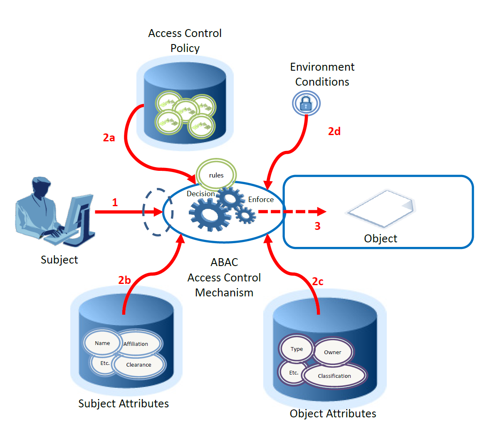
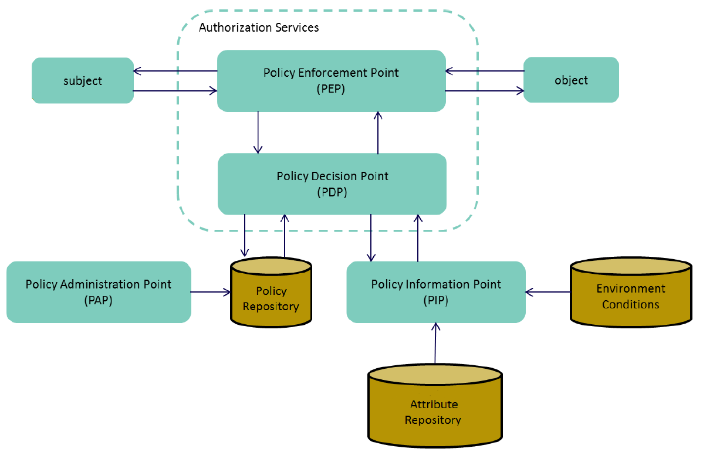

# access-control

## Описание домена

A logical object — sometimes referred to as a resource — is an entity to be protected from unauthorized use. 

The subject represents the entity requesting to perform an operation upon the object. 

The subject is sometimes referred to as a requestor. The subject is most often assumed to be a human. 

There are characteristics or attributes of a subject such as name, date of birth, home address, training record, and job function that may, either individually or when combined, comprise a unique identity that distinguishes that person from all others. 

These characteristics are often called subject attributes. 

Authentication is the act of verifying that the subject has been authorized to use the presented identifier by a trusted identity provider organization. 

Access control or authorization, on the other hand, is the decision to permit or deny a subject access to system objects (network, data, application, service, etc.) 

Privileges represent the authorized behavior of a subject; they are defined by an authority and embodied in policy or rules. 

Environment conditions are dynamic factors, independent of subject and object, that may be used as attributes at decision time to influence an access decision. 

Examples of environment conditions include time, location, threat level, and temperature.

Policy, rules, and relationships govern allowable behavior within an organization, based on the privileges of subjects and how resources or objects are to be protected under which environment conditions. 

Policy is typically written from the perspective of the object that needs protecting and the privileges available to subjects.

Like subjects, each object has a set of attributes that help describe and identify it. These traits are called object attributes and are sometimes referred to as resource attributes. 

Object attributes are typically bound to their objects through reference, by embedding them within the object, or through some other means of assured association such as cryptographic binding.

These policies must be enforced through some type of access control mechanism. 

The access control mechanism must assemble authorization information, which may include 

- information about the object being protected, 
- the subject requesting access, 
- the policies governing access to the resource, and 
- any contextual information needed to make a decision. 
 
By evaluating each policy element against the available information, the access control mechanism often employs

- a policy decision point (PDP) to render a decision, 
- a policy enforcement point (PEP) to enforce the decision, and 
- some sort of context handler or workflow coordinator to manage the collection of attributes required for the decision. 

## Основные определения 

Attribute Based Access Control (ABAC): An access control method where subject requests to perform operations on objects are granted or denied based on assigned attributes of the subject, assigned attributes of the object, environment conditions, and a set of policies that are specified in terms of those attributes and conditions.

Attributes are characteristics of the subject, object, or environment conditions. Attributes contain information given by a name-value pair.

A subject is a human user or NPE, such as a device that issues access requests to perform operations on objects. Subjects are assigned one or more attributes. For the purpose of this document, assume that subject and user are synonymous.

An object is a system resource for which access is managed by the ABAC system, such as devices, files, records, tables, processes, programs, networks, or domains containing or receiving information. It can be the resource or requested entity, as well as anything upon which an operation may be performed by a subject including data, applications, services, devices, and networks.

An operation is the execution of a function at the request of a subject upon an object. Operations include read, write, edit, delete, copy, execute, and modify.

Policy is the representation of rules or relationships that makes it possible to determine if a requested access should be allowed, given the values of the attributes of the subject, object, and possibly environment conditions.

Environment conditions: operational or situational context in which access requests occur. Environment conditions are detectable environmental characteristics. Environment characteristics are independent of subject or object, and may include the current time, day of the week, location of a user, or the current threat level.

## Типовой сценарий

1.Subject requests access to object

2.Access Control Mechanism evaluates 
    a) Rules, 
    b) Subject Attributes, 
    c) Object Attributes, and 
    d) Environment Conditions to compute a decision

3.Subject is given access to object if authorized

## Ключевые механизмы ABAC

Policy Decision Point (PDP): Computes access decisions by evaluating the applicable DPs and MPs. One of the main functions of the PDP is to mediate or deconflict DPs according to MPs.

Policy Enforcement Point (PEP): Enforces policy decisions in response to a request from a subject requesting access to a protected object; the access control decisions are made by the PDP.

Policy Information Point (PIP): Serves as the retrieval source of attributes, or the data required for policy evaluation to provide the information needed by the PDP to make the decisions.

Policy Administration Point (PAP): Provides a user interface for creating, managing, testing, and debugging DPs and MPs, and storing these policies in the appropriate repository.

Context Handler: Executes the workflow logic that defines the order in which policy and attributes are retrieved and enforced.

## Имплементация

Часть описанной выше функциональности реализовано внутренними механизмами ASP.NET. 

Поэтому предполагается задействовать механику ASP.NET для имплементации основных компонентов ABAC модели. Ресурсы по теме:

- [Resource-based authorization in ASP.NET Core](https://learn.microsoft.com/en-us/aspnet/core/security/authorization/resourcebased?view=aspnetcore-9.0)
- [Policy-based authorization in ASP.NET Core](https://learn.microsoft.com/en-us/aspnet/core/security/authorization/policies?view=aspnetcore-9.0)
- [Implement Custom Authorization Policy Provider in ASP.NET Core](https://code-maze.com/aspnetcore-implement-custom-authorization-policy-provider-in-asp-net-core/)
- [Creating Custom Authorization Policy Provider In ASP.NET Core](https://www.c-sharpcorner.com/article/creating-custom-authorization-policy-provider-in-asp-net-code/)
- [Nice to knows when implementing policy-based authorization in .NET](https://timdeschryver.dev/blog/nice-to-knows-when-implementing-policy-based-authorization-in-net)
- [Globally Require Authenticated Users By Default Using Fallback Policies in ASP.NET Core](https://scottsauber.com/2020/01/20/globally-require-authenticated-users-by-default-using-fallback-policies-in-asp-net-core/)
- [Authorization with external service sample](https://github.com/dotnet/AspNetCore.Docs.Samples/tree/main/samples/aspnetcore-authz-with-ext-authz-service)

- 

79108306	0 -> 1	VTBRM	Cash	RU_Kondor_IB_FX	8,721,517
78665546	0 -> 1	VTBRM	Cash	RU_Kondor_IB_FX	8,253,045
78841829	1 -> 2	VTBRM	Cash	RU_Kondor_IB_FX	8,531,589

